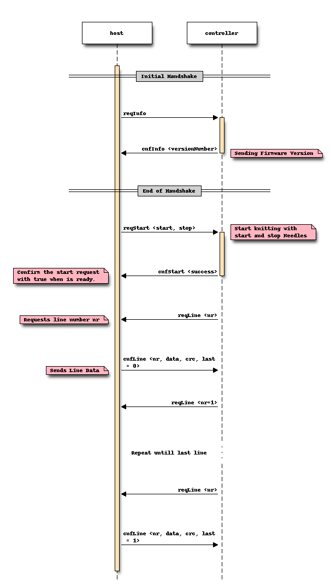

Communication
=============

This document specifies the communication between the host computer and the
Controller.

Serial Communication
--------------------

115200 baud

Line Ending: ``\n\r`` (10 13)  
Each message ends with a Line Ending.

Sequence Chart
--------------

Message Identifier Format
-------------------------

Message identifier format

0b"**AB**rr **CCCC**"

======= ===================== =====================
  Bit        Description             Values
======= ===================== =====================
A       message source
                              - 0 = host
                              - 1 = hardware
B	    message type
                              - 0 = request
                              - 1 = confirm
r	    reserved

CCCC	message identifier
======= ===================== =====================

Message definitions (API v4)
----------------------------

The length is the total length with id and parameters.

========== ========== ==== ====== =============================================
  source      name     id  length        parameters
========== ========== ==== ====== =============================================
host       .. _m4-01: 0x01 3      ``0xaa 0xbb``

           reqStart_              - ``aa`` = startNeedle (Range: 0..198)
                                  - ``bb`` = stopNeedle  (Range: 1..199)
hardware   .. _m4-C1: 0xC1 2      ``0x0a``

           cnfStart_              - ``a`` = success (0 = false, 1 = true)
hardware   .. _m4-82: 0x82 2      ``0xaa``

           reqLine_               - ``aa`` = lineNumber (Range: 0..255)
host       .. _m4-42: 0x42 29     ``0xaa 0xbb[24, 23, 22, ... 1, 0] 0xcc 0xdd``

           cnfLine_               - ``aa`` = lineNumber (Range: 0..255)
                                  - ``bb[24 to 0]`` = binary pixel data
                                  - ``cc`` = flags (bit 0: lastLine)
                                  - ``dd`` = CRC8 Checksum
host       .. _m4-03: 0x03 1

           reqInfo_
hardware   .. _m4-C3: 0xC3 4      ``0xaa 0xbb 0xcc``

           cnfInfo_               - ``aa`` = Version identifier
                                  - ``bb`` = Major Version
                                  - ``cc`` = Minor Version
hardware   .. _m4-84: 0x84 2      ``0x0a``

           indState_              - a = initialized (0 = false, 1 = true)
hardware   .. _m4-FF: 0xFF var    a debug string

           debug_
========== ========== ==== ====== =============================================

.. _reqstart:

The ``reqStart`` Message
~~~~~~~~~~~~~~~~~~~~~~~~

The host starts the knitting process.

- Python: :class:`RequestStart <AYABInterface.communication.host_messages.RequestStart>`
- Arduino: `h_reqStart <https://github.com/AllYarnsAreBeautiful/ayab-firmware/blob/c236597c6fdc6d320f9f2db2ebeb17d64c438b64/ayab.ino#L57>`__
- table: :ref:`reqStart <m4-01>`
- requests answer: :ref:`cnfstart`
- direction: host → controller

.. _cnfstart:

The ``cnfStart`` Message
~~~~~~~~~~~~~~~~~~~~~~~~

The controller indicates the success of :ref:`reqstart`.

- Python: :class:`~AYABInterface.communication.hardware_messages.ConfigurationStart`
- Arduino: `h_reqStart <https://github.com/AllYarnsAreBeautiful/ayab-firmware/blob/c236597c6fdc6d320f9f2db2ebeb17d64c438b64/ayab.ino#L74>`__
- table: :ref:`reqStart <m4-C1>`
- answers: `The reqStart Message`_
- direction: controller → host

.. _reqline:

The ``reqLine`` Message
~~~~~~~~~~~~~~~~~~~~~~~

The controller requests a new line from the host.

- Python: :class:`~AYABInterface.communication.hardware_messages.LineRequest`
- Arduino: `Knitter::reqLine <https://github.com/AllYarnsAreBeautiful/ayab-firmware/blob/c236597c6fdc6d320f9f2db2ebeb17d64c438b64/knitter.cpp#L366>`__
- table: :ref:`reqLine <m4-82>`
- requests answer: `The cnfLine Message`_
- direction: controller → host

.. _cnfline:

The ``cnfLine`` Message
~~~~~~~~~~~~~~~~~~~~~~~

The host answers `The reqLine Message`_ with a line configuration.

- Python: :class:`~AYABInterface.communication.host_messages.LineConfiguration`
- Arduino: `h_cnfLine <https://github.com/AllYarnsAreBeautiful/ayab-firmware/blob/c236597c6fdc6d320f9f2db2ebeb17d64c438b64/ayab.ino#L80>`__
- table: :ref:`cnfLine <m4-42>`
- answers: `The reqLine Message`_
- direction: host → controller

.. _reqinfo:

The ``reqInfo`` Message
~~~~~~~~~~~~~~~~~~~~~~~

The host initializes the handshake.

- Python: :class:`~AYABInterface.communication.host_messages.InformationRequest`
- Arduino: `h_reqInfo <https://github.com/AllYarnsAreBeautiful/ayab-firmware/blob/c236597c6fdc6d320f9f2db2ebeb17d64c438b64/ayab.ino#L110>`__
- table: :ref:`reqInfo <m4-03>`
- requests answer: `The cnfInfo Message`_
- direction: host → controller

.. _cnfinfo:

The ``cnfInfo`` Message
~~~~~~~~~~~~~~~~~~~~~~~

The controller answers `The reqInfo Message`_ with the API version.

- Python: :class:`~AYABInterface.communication.hardware_messages.ConfigurationInformation`
- Arduino: `h_reqInfo <https://github.com/AllYarnsAreBeautiful/ayab-firmware/blob/c236597c6fdc6d320f9f2db2ebeb17d64c438b64/ayab.ino#L112>`__
- table: :ref:`cnfInfo <m4-C3>`
- answers: `The reqInfo Message`_
- direction: controller → host

.. _indstate:

The ``indState`` Message
~~~~~~~~~~~~~~~~~~~~~~~~

TODO: When is this sent?

- Python: :class:`~AYABInterface.communication.hardware_messages.InitializationIndication`
- Arduino: `Knitter::indState <https://github.com/AllYarnsAreBeautiful/ayab-firmware/blob/c236597c6fdc6d320f9f2db2ebeb17d64c438b64/knitter.cpp#L375>`__
- table: :ref:`indState <m4-84>`
- direction: controller → host

.. _debug:

The ``debug`` Message
~~~~~~~~~~~~~~~~~~~~~

TODO: How to parse this message?

- Python: :class:`~AYABInterface.communication.hardware_messages.Debug`
- Arduino: `DEBUG_PRINT <https://github.com/AllYarnsAreBeautiful/ayab-firmware/blob/c236597c6fdc6d320f9f2db2ebeb17d64c438b64/debug.h#L32>`
- table: :ref:`debug <m4-FF>`
- direction: controller → host

References
~~~~~~~~~~

.. seealso::
  - `the original specification
    <https://bitbucket.org/chris007de/ayab-apparat/wiki/english/Software/SerialCommunication>`__
  - the :mod:`hardware messages module
    <AYABInterface.communication.hardware_messages>`
    for messages sent by the hardware
  - the :mod:`host messages module
    <AYABInterface.communication.host_messages>`
    for messages sent by the host
